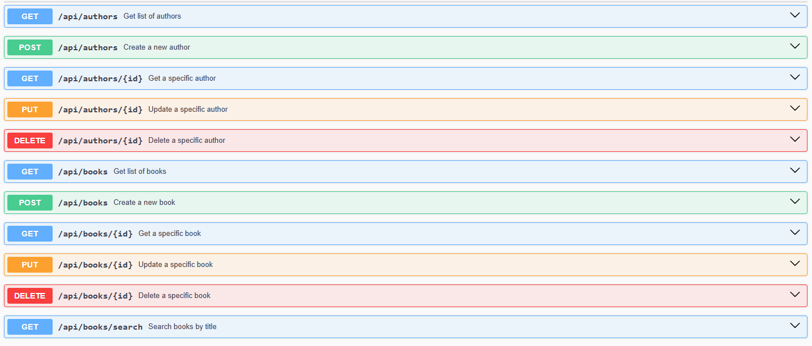

# Learning Management System (Laravel)

This repository contains a simple Learning Management System (LMS) built using the Laravel framework. The system allows users to manage authors, books, and perform searches for books by title.

## Requirements

To run this project, ensure you have the following installed:

- PHP >= 8.2
- Composer
- Laravel 11.9
- Laravel Sanctum 4.0
- Darkaonline L5 Swagger 8.6
- Laravel Tinker 2.9
- MySQL server
- Other dependencies specified in `composer.json`

## Installation

1. Navigate to the project directory: `cd lms`
2. Install PHP dependencies using Composer: `composer install`
3. Set up your environment file: `cp .env.example .env`
4. Update the `.env` file with your MySQL database credentials:
    - DB_CONNECTION=mysql
    - DB_HOST=127.0.0.1
    - DB_PORT=3306
    - DB_DATABASE=your_database_name
    - DB_USERNAME=your_database_username
    - DB_PASSWORD=your_database_password
5. Generate an application key: `php artisan key:generate`
6. Migrate the database: `php artisan migrate`
7. Serve the application: `php artisan serve`

## Usage

Use the provided API endpoints to manage authors and books. Search for books by title using the `/api/books/search` endpoint. Explore the Swagger documentation for detailed API usage.

## API Endpoints

### Authors
- `POST /api/authors`: Create a new author.
- `GET /api/authors`: List all authors.
- `GET /api/authors/{id}`: Retrieve a specific author by ID.
- `PUT /api/authors/{id}`: Update a specific author by ID.
- `DELETE /api/authors/{id}`: Delete a specific author by ID.

### Books
- `POST /api/books`: Create a new book.
- `GET /api/books`: List all books.
- `GET /api/books/{id}`: Retrieve a specific book by ID.
- `PUT /api/books/{id}`: Update a specific book by ID.
- `DELETE /api/books/{id}`: Delete a specific book by ID.
- `GET /api/books/search?title={title}`: Search for books by title.

## Documentation

Explore the Swagger documentation for detailed API specifications and request/response examples.
